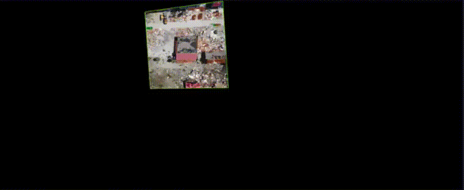
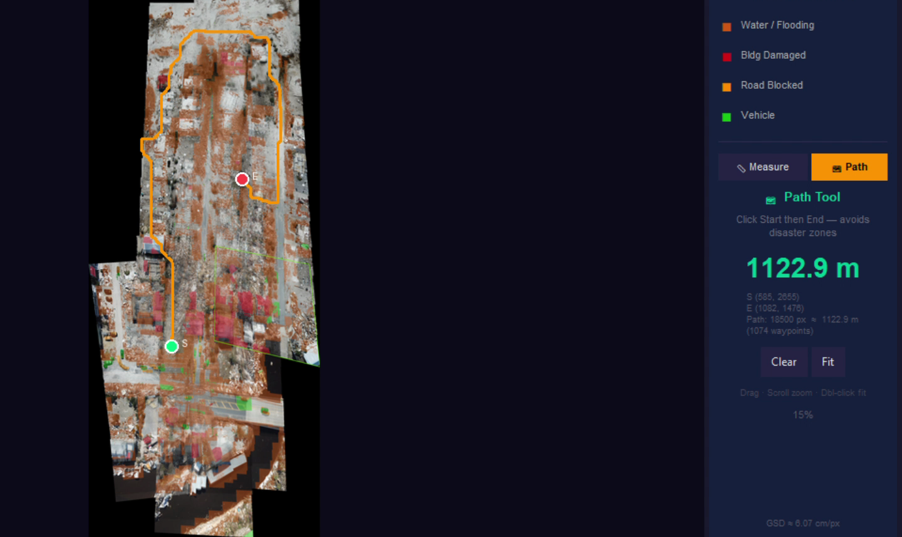

# RapidGeoStitch

Real-time multi-modal environmental assessment from UAV imagery. RapidGeoStitch fuses RGB aerial imagery, GPS/EXIF geospatial metadata, and monocular depth estimation into an incrementally-built georeferenced mosaic — segmenting environmental impact zones and overlaying them as the mosaic builds.



## Motivation

Post-disaster environments — flooded lowlands, collapsed infrastructure, blocked transport corridors — demand rapid spatial situational awareness. Traditional mapping is too slow: images must be transferred, processed offline, and returned to field teams minutes or hours later. RapidGeoStitch runs the full pipeline on-device as a UAV sequence arrives, giving responders a metric-accurate environmental damage map within seconds of the drone landing.



## Overview

Four sensing and processing stages chain into a single live GUI:

| Stage | Modality | Module | Description |
|-------|----------|--------|-------------|
| 1. Geospatial | GPS / EXIF | `src/metric_scale.py` | Estimates ground sampling distance (GSD, m/px) from image EXIF metadata |
| 2. Visual Detection | RGB | `detection/predict.py` | Tiled YOLOv8 inference on full-res images (640 px tiles, 64 px overlap) |
| 3. Semantic Segmentation | RGB + CV | `segmentation/segment_cv.py` | Classical CV per-class masking inside YOLO boxes (no GPU required) |
| 4. Spatial Fusion | RGB + depth | `src/stitchwise/` | SIFT feature matching → RANSAC homographies → global pose solve → georeferenced mosaic |

The result is a pannable mosaic with color-coded environmental impact overlays and two interactive tools: metric distance measurement and A\* shortest-path routing that avoids all hazard zones.

## Multi-modal Sensing

RapidGeoStitch integrates three complementary sensing modalities:

| Modality | Source | Role |
|----------|--------|------|
| RGB imagery | UAV camera | Detection, segmentation, and visual stitching |
| GPS / EXIF metadata | Embedded image tags | Metric scale (GSD) estimation — no ground control points needed |
| Monocular depth | Depth Anything V2 | Metric scale fallback when EXIF data is absent |

This fusion enables metric-accurate environmental maps from commodity UAV hardware operating in degraded or GNSS-limited conditions.

## Environmental Impact Categories

The model detects five environmental assessment categories trained on the RescueNet UAV dataset:

| ID | Category | Overlay | Environmental Significance |
|----|----------|---------|---------------------------|
| 0 | Flood Zone | Blue | Hydrological hazard extent and inundation boundary |
| 1 | Structural Damage | Red | Built environment integrity and collapse risk |
| 2 | Blocked Route | Orange | Accessibility corridors and evacuation route status |
| 3 | Vehicle / Asset | Green | Rescue resource and equipment tracking |
| 4 | Vegetation Damage | Chartreuse | Canopy loss, fallen trees, and ecosystem disruption |

## Project Structure

```
RapidGeoStitch/
├── live_view.py                 # Main entry point — GUI + pipeline orchestrator
├── detection/
│   ├── model/best.pt            # Final YOLOv8 weights (RescueNet, 5 classes)
│   ├── predict.py               # Tiled inference + cross-tile NMS
│   ├── train.py                 # Training script
│   ├── prepare_rescuenet.py     # Dataset preparation for RescueNet
│   └── evaluate.py              # Evaluation script
│
├── segmentation/
│   └── segment_cv.py            # Classical CV segmenter
│
├── src/
│   ├── metric_scale.py          # GSD estimation from EXIF
│   ├── exif_extractor.py        # EXIF parser
│   ├── depth_model.py           # Depth Anything V2 fallback
│   └── stitchwise/              # Stitching library
│       ├── features.py          # SIFT extraction
│       ├── matching.py          # Feature matching
│       ├── geometry.py          # Homography estimation
│       ├── pipeline_pairwise.py # Pairwise registration
│       ├── blending.py          # Multi-band blending
│       ├── warping.py           # Perspective warp utilities
│       ├── io_utils.py          # Image loading / resize
│       └── config.py            # Config dataclass
│
├── scripts/
│   ├── build_pair_graph.py      # Build SIFT match graph from image directory
│   ├── solve_global_no_ba.py    # Solve global poses
│   ├── render_global_no_ba.py   # Render final mosaic from cached poses
│   ├── validate_global_no_ba.py # Validate reprojection errors
│   └── ...
│
├── configs/
│   └── stitching.yaml           # Stitching hyper-parameters
└── requirements.txt
```

## Setup

### Prerequisites

- Python 3.10+
- Windows / macOS / Linux
- GPU optional (CUDA or MPS auto-detected; CPU works fine)

### Install

```bash
python -m venv C:/sw_env          # Windows
python -m venv venv               # macOS/Linux

C:/sw_env/Scripts/activate        # Windows
source venv/bin/activate          # macOS/Linux

# Install PyTorch (CPU)
pip install torch torchvision --index-url https://download.pytorch.org/whl/cpu

# Install remaining dependencies
pip install -r requirements.txt
```

## Running the GUI

```bash
python live_view.py --image-dir data/rescuenet_big --ext .jpg
```

### All options

```
--image-dir   PATH    Directory of input images (required)
--ext         STR     File extension, e.g. .jpg or .JPG  [default: .jpg]
--n-frames    INT     Process only the first N frames
--output-dir  PATH    Cache and output directory  [default: outputs/live_view]
--yolo-weights PATH   Path to YOLOv8 weights  [default: detection/model/best.pt]
--conf        FLOAT   YOLO confidence threshold  [default: 0.25]
--offsets     STR     Stitching neighbour offsets  [default: 1,2,3]
--no-seg              Skip detection and segmentation (plain stitching)
--fresh               Delete cached stitching results and rebuild from scratch
```

## GUI Controls

| Action | Control |
|--------|---------|
| Pan | Click + drag |
| Zoom | Scroll wheel (cursor-anchored) |
| Fit to window | Double-click or **Fit** button |
| Switch tool | **Measure** / **Path** buttons |
| Measure distance | Click two points — distance shown in meters |
| Find shortest path | Click two points — path avoids all impact zones |
| Clear points | **Clear** button |

### Path Tool

The Path tool finds the shortest safe route between two clicked points using A\* search on the impact-zone obstacle map. If the destination is unreachable, the path terminates at the nearest accessible cell. Path distance is reported in meters using the estimated mosaic GSD.

## Output

Each run saves:

```
outputs/<run-name>/
├── pair_graph/              SIFT match graph
├── global_no_ba/
│   └── global_poses.json    Homographies for all frames
└── final_mosaic.jpg         Full environmental assessment mosaic (JPEG 95%)
```

## Training the Detection Model

The detection model was fine-tuned on [RescueNet](https://github.com/BinaLab/RescueNet-Challenge) (UAV post-disaster imagery, 4-class subset).

```bash
# 1. Prepare dataset
python detection/prepare_rescuenet.py --data-dir data/rescuenet_raw

# 2. Train
python detection/train.py --data configs/rescuenet.yaml --epochs 100

# 3. Evaluate
python detection/evaluate.py --weights detection/model/best.pt
```

**Model details**
- Architecture: YOLOv8n (nano), 5 classes
- Training classes: water, building-major-damage, road-blocked, vehicle, tree (RescueNet IDs 1, 4, 7, 8, 9)
- Inference: tiled 640 px crops with 64 px overlap; cross-tile NMS via `torchvision.ops.batched_nms`

## Segmentation

Classical CV segmentation runs inside every YOLO bounding box — no GPU required. This is the right trade-off for edge deployment on UAV platforms: aerial environmental features (water, vegetation) have strong spectral signatures in HSV and LAB color spaces that simple thresholding exploits directly, without the overhead of a neural segmentation model.

| Category | Method | Rationale |
|----------|--------|-----------|
| Flood Zone | Otsu on LAB L-channel + HSV hue mask (H 85–140) | Water has distinctive blue-green spectral signature |
| Structural Damage | GrabCut + ellipse morph-close (kernel 7) | Irregular debris shapes benefit from iterative refinement |
| Blocked Route | GrabCut + elongated kernel aligned to road axis | Road geometry constrains the segmentation shape |
| Vehicle / Asset | GrabCut + morph-open (noise removal) | Small compact objects; GrabCut isolates well |
| Vegetation Damage | HSV hue mask (H 35–90) + ellipse morph-close (kernel 9) | Vegetation has a strong, reliable green spectral signature |

Large crops are downscaled to ≤150 px before GrabCut and upscaled back. Average segmentation time: ~20–50 ms/image on CPU (vs. ~200–500 ms for SAM-based approaches).

## Dataset

Tested on [RescueNet](https://github.com/BinaLab/RescueNet-Challenge) consecutive UAV sequences extracted from the training split (images 10850–10941). The test split is non-consecutive and unsuitable for stitching.
